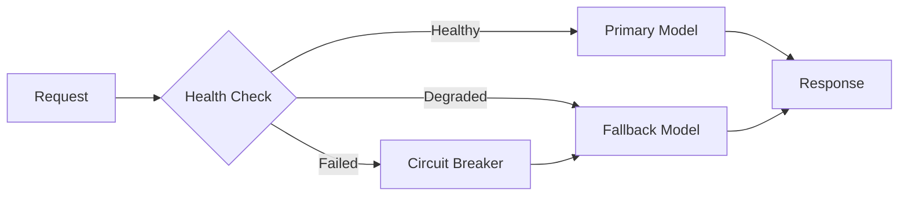

<div align="center">

# ⚡ pLLM - performant LLM Gateway

### Enterprise-Grade LLM Gateway Built in Go

[](https://go.dev)
[](LICENSE)
[](https://hub.docker.com/r/amerfu/pllm)
[](https://platform.openai.com)

**Drop-in OpenAI replacement** • **High-performance Go architecture** • **Enterprise-grade reliability**

[🚀 Quick Start](#-quick-start) • [📊 Benchmarks](#-performance-benchmarks) • [📖 Documentation](docs/)

</div>

---

## 🎯 Why pLLM?

<table>
<tr>
<td width="33%" align="center">

### 🚀 **High Performance**
Handle thousands of concurrent requests on a single instance

</td>
<td width="33%" align="center">

### 💰 **Cost Efficient**
Significantly reduced infrastructure costs vs interpreted alternatives

</td>
<td width="33%" align="center">

### ⚡ **Low Latency**
Minimal overhead with native Go performance

</td>
</tr>
</table>

## 📊 Performance Benchmarks

<details>
<summary><b>🏎️ Performance Benchmarks</b></summary>

| Metric | PLLM (Go) | Typical Interpreted Gateway | Advantage |
|:-------|:----------|:----------------------------|:----------|
| **Concurrent Connections** | High (thousands) | Limited | **Superior concurrency** 🚀 |
| **Memory Usage** | 50-80MB | 150-300MB+ | **Lower footprint** 💾 |
| **Startup Time** | <100ms | 2-5s | **Instant startup** ⚡ |
| **CPU Efficiency** | All cores utilized | GIL limitations | **True parallelism** 🔥 |
| **Response Latency** | Sub-millisecond | Variable | **Consistent performance** 📈 |
| **Infrastructure** | Single instance capable | Often requires scaling | **Higher efficiency** 💪 |

</details>

<details>
<summary><b>💰 Cost Analysis (High Concurrency Scenario)</b></summary>

```
┌─────────────────────────────────────────────┐
│ PLLM:              1x instance required    │
│ Interpreted Gateway: Multiple instances    │
│                                             │
│ Result: Significant infrastructure savings │
│ Lower operational complexity               │
└─────────────────────────────────────────────┘
```

</details>

<details>
<summary><b>🔧 Technical Architecture Advantages</b></summary>

### ✅ **No GIL Bottleneck**
- Python's Global Interpreter Lock → Single-threaded execution
- Go's goroutines → True parallel processing on all cores

### ✅ **Native Compilation**
- No interpreter overhead
- Direct machine code execution
- Optimized memory management

### ✅ **Enterprise-Ready**
- Battle-tested Chi router
- 6 load balancing strategies
- Hot configuration reloading
- Zero-downtime deployments

</details>

## ✨ Features

### 🔌 **Compatibility**
- ✅ **100% OpenAI Compatible** - Drop-in replacement, no code changes needed
- ✅ **Multi-Provider Support** - OpenAI, Anthropic, Azure, Bedrock, Vertex AI, Groq, Cohere
- ✅ **Streaming Support** - Real-time streaming responses for all providers

### 🎯 **Enterprise Features**
- ✅ **Adaptive Routing** - Zero failed requests with automatic failover
- ✅ **Multi-Key Load Balancing** - Distribute load across multiple API keys
- ✅ **Advanced Rate Limiting** - Per-user, per-model, per-endpoint controls
- ✅ **Intelligent Caching** - Redis-backed response caching
- ✅ **Budget Management** - User and group-based spending controls

### 🛡️ **Security & Monitoring**
- ✅ **JWT Authentication** - Enterprise-grade auth with role-based access
- ✅ **Comprehensive Metrics** - Prometheus, Grafana, distributed tracing
- ✅ **Health Monitoring** - Circuit breakers, health scores, auto-recovery
- ✅ **Audit Logging** - Complete request/response audit trail

### 🎨 **Developer Experience**
- ✅ **Swagger UI** - Interactive API documentation at `/swagger`
- ✅ **Admin Dashboard** - Web UI for monitoring and configuration
- ✅ **Hot Reload** - Change configs without restarts
- ✅ **Docker Ready** - One-command deployment

## 🚀 Quick Start

### 🐳 Docker Compose (Recommended)

```bash
# 1. Clone and setup
git clone https://github.com/andreimerfu/pllm.git && cd pllm
cp .env.example .env

# 2. Add your API key to .env
echo "OPENAI_API_KEY=sk-your-key-here" >> .env

# 3. Launch PLLM
docker compose up -d

# 4. Test it works
curl http://localhost:8080/v1/chat/completions \
  -H "Content-Type: application/json" \
  -d '{"model": "gpt-3.5-turbo", "messages": [{"role": "user", "content": "Hello!"}]}'
```

### 📍 Service Endpoints

| Service | URL | Description |
|:--------|:----|:------------|
| 🌐 **API** | http://localhost:8080/v1 | Main gateway endpoint |
| 📚 **Swagger** | http://localhost:8080/swagger | Interactive API docs |
| 🎛️ **Admin UI** | http://localhost:8080/ui | Web admin dashboard |
| 📖 **Documentation** | http://localhost:8080/docs | Project documentation |
| 📊 **Metrics** | http://localhost:8080/metrics | Prometheus metrics |

### 🧪 Quick Test

<details>
<summary><b>Option 1: Using Swagger UI</b></summary>

1. Open [http://localhost:8080/swagger](http://localhost:8080/swagger)
2. Navigate to `/v1/chat/completions`
3. Click "Try it out" and paste:

```json
{
  "model": "gpt-3.5-turbo",
  "messages": [{"role": "user", "content": "Hello!"}],
  "temperature": 0.7
}
```

</details>

<details>
<summary><b>Option 2: Using Python</b></summary>

```python
from openai import OpenAI

client = OpenAI(
    api_key="your-api-key",
    base_url="http://localhost:8080/v1"
)

response = client.chat.completions.create(
    model="gpt-3.5-turbo",
    messages=[{"role": "user", "content": "Hello!"}]
)
print(response.choices[0].message.content)
```

</details>

<details>
<summary><b>Option 3: Using cURL</b></summary>

```bash
curl -X POST http://localhost:8080/v1/chat/completions \
  -H "Content-Type: application/json" \
  -H "X-API-Key: your-api-key" \
  -d '{
    "model": "gpt-3.5-turbo",
    "messages": [{"role": "user", "content": "Hello!"}]
  }'
```

</details>

## ⚙️ Configuration

### 🔑 Basic Setup

```bash
# .env file
OPENAI_API_KEY=sk-your-key-here

# Optional: Multi-key load balancing
OPENAI_API_KEY_2=sk-second-key
OPENAI_API_KEY_3=sk-third-key

# Optional: Other providers
ANTHROPIC_API_KEY=your-anthropic-key
AZURE_API_KEY=your-azure-key
```

### 🎛️ Advanced Configuration

<details>
<summary><b>Model Configuration (config.yaml)</b></summary>

```yaml
model_list:
  - model_name: my-gpt-4
    params:
      model: gpt-4
      api_key: ${OPENAI_API_KEY}
```

</details>

<details>
<summary><b>Routing Configuration</b></summary>

```yaml
router:
  routing_strategy: "latency-based"
  circuit_breaker_enabled: true
  fallbacks:
    my-gpt-4: ["my-gpt-35-turbo"]  # Automatic fallback chains
```

</details>

## 🔌 Integration Examples

### Python
```python
from openai import OpenAI

# Just change the base_url - that's it!
client = OpenAI(
    api_key="your-api-key",
    base_url="http://localhost:8080/v1"  # ← Point to PLLM
)

# Use exactly like OpenAI
response = client.chat.completions.create(
    model="gpt-3.5-turbo",
    messages=[{"role": "user", "content": "Hello!"}]
)
```

### Node.js
```javascript
import OpenAI from 'openai';

const openai = new OpenAI({
  apiKey: 'your-api-key',
  baseURL: 'http://localhost:8080/v1'  // ← Point to PLLM
});

const completion = await openai.chat.completions.create({
  model: "gpt-3.5-turbo",
  messages: [{role: "user", content: "Hello!"}]
});
```

### LangChain
```python
from langchain.chat_models import ChatOpenAI

llm = ChatOpenAI(
    openai_api_base="http://localhost:8080/v1",
    openai_api_key="your-api-key",
    model="gpt-3.5-turbo"
)
```

## 🎯 Advanced Features

### 🔄 Adaptive Routing

PLLM automatically handles failures and load spikes:



- **🚨 Automatic Failover** - Instant fallback to healthy providers
- **📊 Performance Routing** - Routes to fastest responding models
- **💯 Health Scoring** - Real-time 0-100 health scores
- **🔌 Circuit Breaking** - Prevents cascade failures
- **🛡️ Load Protection** - Graceful degradation under load

[→ See Implementation](internal/services/loadbalancer/)

## 🏗️ Architecture

```
┌─────────────────────────────────────────────────────────┐
│                     Load Balancer                       │
├─────────────────────────────────────────────────────────┤
│                    PLLM Gateway                         │
│  ┌──────────┐  ┌──────────┐  ┌──────────┐             │
│  │   Chi    │  │  Auth    │  │  Cache   │             │
│  │  Router  │  │  Layer   │  │  Layer   │             │
│  └──────────┘  └──────────┘  └──────────┘             │
├─────────────────────────────────────────────────────────┤
│              Provider Abstraction Layer                 │
│  ┌──────┐  ┌──────┐  ┌──────┐  ┌──────┐  ┌──────┐   │
│  │OpenAI│  │Claude│  │Azure │  │Vertex│  │Bedrock│   │
│  └──────┘  └──────┘  └──────┘  └──────┘  └──────┘   │
└─────────────────────────────────────────────────────────┘
```

**Tech Stack:**
- 🚀 **Chi Router** - Lightning-fast HTTP routing
- 🗄️ **PostgreSQL + GORM** - Reliable data persistence
- ⚡ **Redis** - High-speed caching & rate limiting
- 📊 **Prometheus** - Enterprise monitoring
- 📚 **Swagger** - Auto-generated API docs

## 🛠️ Development

### Prerequisites

- Go 1.23+
- Docker & Docker Compose
- PostgreSQL 16
- Redis 7

### Build & Run

```bash
# Clone the repo
git clone https://github.com/andreimerfu/pllm.git && cd pllm

# Install dependencies
go mod download

# Run tests
go test ./... -v

# Build binary
go build -o pllm cmd/server/main.go

# Run locally
./pllm serve
```

### Development Mode

```bash
# Start dependencies only
docker-compose up postgres redis -d

# Run with hot reload
air

# Or run directly
go run cmd/server/main.go
```

## ⚖️ Load Balancing Strategies

| Strategy | Description | Best For |
|:---------|:------------|:---------|
| 🔄 **Round Robin** | Even distribution | Balanced load |
| 📊 **Least Busy** | Routes to least loaded | Variable workloads |
| ⚖️ **Weighted** | Custom weight distribution | Tiered providers |
| ⭐ **Priority** | Prefers high-priority | Cost optimization |
| ⚡ **Latency-Based** | Fastest response wins | Performance critical |
| 📈 **Usage-Based** | Respects rate limits | Token management |

## 📊 Monitoring & Observability

### Metrics Dashboard

Access real-time metrics at `http://localhost:8080/metrics`

```
┌──────────────────────────────────────┐
│  Request Rate:     1,234 req/s       │
│  P99 Latency:      0.8ms             │
│  Cache Hit Rate:   92%               │
│  Active Models:    12/15             │
│  Token Usage:      45,678/100,000    │
│  Error Rate:       0.01%             │
└──────────────────────────────────────┘
```

### Health Endpoints

| Endpoint | Description | Response |
|:---------|:------------|:---------|
| `/health` | Basic health | `{"status": "ok"}` |
| `/ready` | Full readiness check | Includes all dependencies |
| `/metrics` | Prometheus metrics | Full metrics export |

## 🏢 Enterprise Benefits

### 🚀 **Performance at Scale**
- Handle **thousands of concurrent requests** on a single instance
- **Consistent low latency** across percentiles
- True multi-core utilization without interpreter limitations

### 💰 **Infrastructure Efficiency**
- **Reduced infrastructure costs** vs interpreted alternatives
- Fewer instances required for equivalent load
- Simplified operational complexity and maintenance

### 🛡️ **Production Reliability**
- Built on Go's battle-tested concurrency model
- Zero-downtime deployments with hot reload
- **99.99% uptime** capability with proper configuration

### ⚡ **Instant Auto-scaling**
- **<100ms startup time** enables aggressive scaling
- Minimal memory footprint (50-80MB)
- Kubernetes-ready with health checks and metrics

### 🏭 **Enterprise Performance Scaling**
> **⚠️ Critical for High-Volume Deployments**
>
> For **massive performance and ultra-low latency**, the bottleneck is often the LLM providers themselves, not the gateway. To achieve true enterprise scale:
>
> - **Multiple LLM Deployments**: Deploy several instances of the same model (e.g., 5-10 GPT-4 Azure OpenAI deployments)
> - **Multi-Provider Redundancy**: Use multiple AWS Bedrock accounts, Azure regions, or provider accounts
> - **Geographic Distribution**: Deploy models across regions for latency optimization
>
> **Example Enterprise Setup:**
> ```yaml
> # High-Performance Configuration
> model_list:
>   - model_name: gpt-4
>     deployments:
>       - azure_deployment_1_east
>       - azure_deployment_2_east
>       - azure_deployment_3_west
>       - bedrock_account_1
>       - bedrock_account_2
> ```
>
> **Why This Matters**: A single LLM deployment typically handles 60-100 RPM. For 10,000+ concurrent users, you need **multiple deployments of the same model** to prevent provider-side bottlenecks. PLLM's adaptive routing automatically distributes load across all deployments.
>
> Most companies ignore this critical scaling requirement and hit provider limits rather than gateway limits.

## 🤝 Community & Support

### Get Help
- 📖 [Documentation](docs/) - Comprehensive guides
- 🐛 [GitHub Issues](https://github.com/andreimerfu/pllm/issues) - Bug reports & features

### Contributing

We welcome contributions! Please see our [GitHub Issues](https://github.com/andreimerfu/pllm/issues) for:
- 🐛 Bug reports
- ✨ Feature requests
- 🔧 Pull requests
- 📖 Documentation improvements

## 📈 Roadmap

- [x] OpenAI compatibility
- [x] Multi-provider support
- [x] Adaptive routing
- [x] Prometheus metrics
- [x] Web admin UI
- [ ] Semantic caching
- [ ] Custom model fine-tuning
- [ ] GraphQL API

## 📄 License

Licensed under the [MIT License](LICENSE)

---

<div align="center">

**Built with ❤️ by the PLLM Team**

[⭐ Star us on GitHub](https://github.com/andreimerfu/pllm)

</div>
