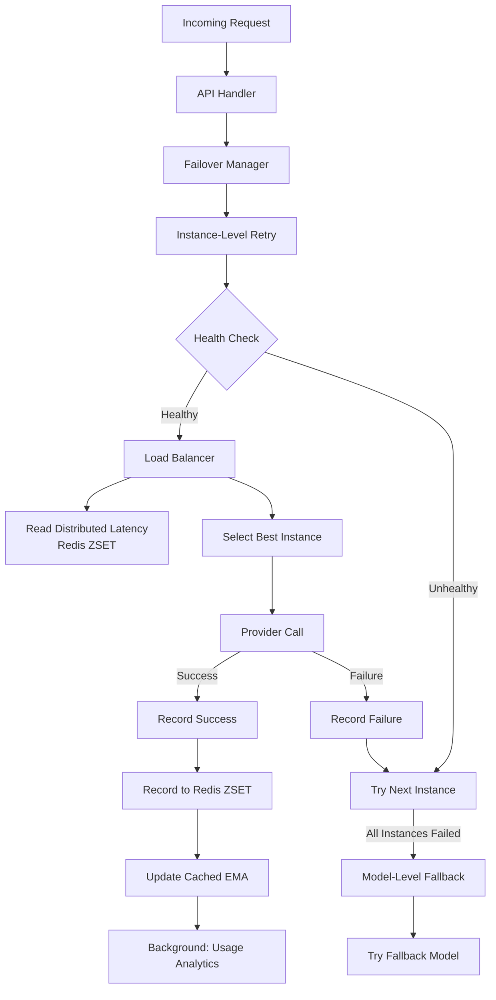

# Resilience & Reliability

PLLM implements a comprehensive resilience strategy combining **automatic failover**, **health tracking**, **load balancing**, and **distributed latency tracking** to ensure banking-grade reliability for LLM operations.

## Architecture Overview



## Failover System

PLLM's failover system provides **transparent recovery** from failures, ensuring end users receive responses even when individual instances or models fail.

### Two-Level Failover

**1. Instance-Level Retry**
- Automatically retry requests across multiple instances of the same model
- Intelligent routing selects best available instance
- Failed instances are temporarily skipped
- Configurable retry attempts per instance

**2. Model-Level Fallback**
- Fall back to different models when all instances fail
- Configurable fallback chains (e.g., GPT-4 → GPT-4-Turbo → GPT-3.5)
- Maintains API compatibility across models
- User-transparent switching

### Configuration

```yaml
router:
  # Enable automatic failover
  enable_failover: true

  # Number of retry attempts per instance (default: 2)
  instance_retry_attempts: 3

  # Enable model-level fallback
  enable_model_fallback: true

  # Timeout multiplier for failover attempts (default: 1.5)
  failover_timeout_multiple: 1.5

  # Model fallback configuration
  model_fallbacks:
    gpt-4: gpt-4-turbo
    gpt-4-turbo: gpt-3.5-turbo
    claude-3-opus: claude-3-sonnet
```

### Failover Behavior

**Scenario 1: Instance Failure**
```
User requests gpt-4
  ↓
Instance 1 (gpt-4) → FAILS (timeout)
  ↓
Instance 2 (gpt-4) → FAILS (connection error)
  ↓
Instance 3 (gpt-4) → SUCCESS ✓
  ↓
User receives response (slower, but no error)
```

**Scenario 2: Model Failure + Fallback**
```
User requests gpt-4
  ↓
Instance 1 (gpt-4) → FAILS
Instance 2 (gpt-4) → FAILS
Instance 3 (gpt-4) → FAILS
  ↓ All instances failed
Fallback to gpt-4-turbo
  ↓
Instance 1 (gpt-4-turbo) → SUCCESS ✓
  ↓
User receives response (from fallback model)
```

### End-User Experience

With failover enabled:
- ✅ **No errors** when individual instances fail
- ✅ **Automatic recovery** across instances and models
- ✅ **Slower response** (due to retries) but **successful completion**
- ✅ **Transparent** - users don't know which instance/model was used

## Health Tracking

PLLM tracks the health of each model instance to make intelligent routing decisions.

### Health Status

Each instance maintains:
- **Healthy flag**: true/false
- **Failure count**: consecutive failures
- **Last error**: most recent error
- **Last success**: timestamp of last successful request

### Health Degradation

```go
// After 3 consecutive failures, instance marked unhealthy
if failureCount >= 3 {
    instance.Healthy = false
    logger.Warn("Instance marked as unhealthy")
}
```

### Health Recovery

```go
// On first success, instance marked healthy again
instance.Healthy = true
instance.FailureCount = 0
```

### Impact on Routing

- **Healthy instances**: Eligible for routing
- **Unhealthy instances**: Filtered out, not considered for requests
- **Auto-recovery**: Unhealthy instances automatically recover on first success

## Latency Tracking Architecture

PLLM uses **Redis-based distributed latency tracking** to share performance metrics across multiple instances/pods.

### Architecture

```
Pod 1 (Request 1: 10s latency)
  ↓
  RecordLatency() → Redis ZSET "pllm:latency:gpt-4"
                     ↓
Pod 2 (Request 2: needs routing decision)
  ↓
  GetAverageLatency() ← Redis ZSET "pllm:latency:gpt-4"
  ↓
  Sees 10s latency from Pod 1
  ↓
  Routes to faster instance
```

### Implementation

**Storage**: Redis Sorted Set (ZSET)
- **Key**: `pllm:latency:{model_name}` (e.g., `pllm:latency:gpt-4`)
- **Score**: Timestamp (for expiry/windowing)
- **Member**: `{latency_ms}:{unique_nanos}` (e.g., `10000:1733419200123456789`)
- **Window**: 5 minutes (configurable)
- **Max Samples**: 1000 per model (configurable)

**On Each Request:**
```go
// 1. Handler measures latency
startTime := time.Now()
response, err := provider.Call(ctx, request)
latency := time.Since(startTime)

// 2. Record to distributed tracker (async, 100ms timeout)
modelManager.RecordRequestEnd("gpt-4", latency, success, err)
  ↓
  latencyTracker.RecordLatency(ctx, "gpt-4", latency)
    ↓
    redis.ZAdd("pllm:latency:gpt-4", {
      Score: timestamp,
      Member: "10000:1733419200123456789"
    })
```

**On Route Selection:**
```go
// Routing strategy uses distributed latency
instance, err := modelManager.GetBestInstance(ctx, "gpt-4")
  ↓
  routingStrategy.SelectInstance(instances)
    ↓
    latencyTracker.GetAverageLatency(ctx, "gpt-4")
      ↓
      redis.Get("pllm:latency:avg:gpt-4")  // EMA cached value
```

### Statistics Available

```go
stats, _ := latencyTracker.GetLatencyStats(ctx, "gpt-4")

// Returns:
// - Average: Exponential Moving Average
// - Min/Max: Across window
// - P50/P95/P99: Percentiles
// - SampleCount: Number of samples in window
// - HealthScore: 0-100 based on P95 latency
```

### Multi-Instance Benefits

**Before (In-Memory Only):**
- ❌ Pod 1: Request takes 10s → stored in Pod 1's memory
- ❌ Pod 2: No knowledge of Pod 1's latency
- ❌ Pod 2: Routes to same slow instance
- ❌ Lost latency data on pod restart

**After (Redis-Distributed):**
- ✅ Pod 1: Request takes 10s → stored in Redis
- ✅ Pod 2: Reads latency from Redis (sees 10s)
- ✅ Pod 2: Routes to faster instance
- ✅ Latency data persists across restarts
- ✅ Consistent routing across all pods

## Routing Strategies

PLLM supports multiple routing strategies to select the best instance for each request.

### Available Strategies

**1. Priority-Based** (`priority`)
- Routes to highest priority instance first
- Static configuration
- Simple and predictable

**2. Latency-Based** (`latency-based`)
- Routes to instance with lowest average latency
- Uses distributed Redis latency tracking
- Adaptive to real-time performance

**3. Weighted Round-Robin** (`weighted`)
- Distributes load based on instance weights
- Balanced distribution
- Good for equal-capacity instances

**4. Least-Busy** (`least-busy`)
- Routes to instance with fewest active requests
- Load-aware routing
- Prevents overloading single instance

### Configuration

```yaml
router:
  routing_strategy: "latency-based"  # or priority, weighted, least-busy

  # Latency tracker settings (optional)
  latency_tracker:
    window_size: 5m      # Time window for samples
    max_samples: 1000    # Max samples per model
    update_period: 10s   # How often to update aggregates
```

## Complete Flow Example

**Scenario:** Request to GPT-4 with full failover enabled

```go
// User makes request
POST /v1/chat/completions
{
  "model": "gpt-4",
  "messages": [...]
}

// Handler flow:
1. ExecuteWithFailover(ctx, "gpt-4", executeFunc)
   ↓
2. Get all instances of "gpt-4"
   ↓
3. Filter healthy instances (3 available)
   ↓
4. Try Instance 1 (priority: 100)
   ↓ FAILS (timeout)
   RecordFailure() → failureCount++
   Remove from healthy list
   ↓
5. Try Instance 2 (priority: 90)
   ↓ FAILS (connection error)
   RecordFailure() → failureCount++
   Remove from healthy list
   ↓
6. Try Instance 3 (priority: 80)
   ↓ SUCCESS ✓
   RecordSuccess() → healthy=true, failureCount=0
   RecordLatency() → Redis
   ↓
7. Return response to user
   Total attempts: 3
   Failovers: ["instance:1(timeout)", "instance:2(connection error)"]
   User sees: Success (slower, but transparent)
```

## Configuration

### YAML Configuration

```yaml
router:
  # Routing strategy
  routing_strategy: "latency-based"

  # Failover configuration
  enable_failover: true
  instance_retry_attempts: 3
  enable_model_fallback: true
  failover_timeout_multiple: 1.5

  # Model fallback chains
  model_fallbacks:
    gpt-4: gpt-4-turbo
    gpt-4-turbo: gpt-3.5-turbo
    claude-3-opus: claude-3-sonnet

# Redis connection (required for distributed latency)
redis:
  host: redis
  port: 6379

models:
  - name: gpt-4
    provider: openai
    priority: 100
    timeout: 30s
    enabled: true

  - name: gpt-4
    provider: openai
    priority: 90
    timeout: 30s
    enabled: true

  - name: gpt-4-turbo
    provider: openai
    priority: 100
    timeout: 30s
    enabled: true
```

### Environment Variables

```bash
# Redis connection
PLLM_REDIS_HOST=redis
PLLM_REDIS_PORT=6379

# Failover settings
PLLM_ENABLE_FAILOVER=true
PLLM_INSTANCE_RETRY_ATTEMPTS=3
PLLM_ENABLE_MODEL_FALLBACK=true
PLLM_FAILOVER_TIMEOUT_MULTIPLE=1.5

# Routing strategy
PLLM_ROUTING_STRATEGY=latency-based
```

## Monitoring & Metrics

### Health Status Endpoint

```bash
curl http://localhost:8080/api/admin/models/stats

{
  "health": [
    {
      "instance_id": "gpt-4-instance-1",
      "is_healthy": true,
      "failure_count": 0,
      "last_success": "2025-01-15T10:30:00Z"
    },
    {
      "instance_id": "gpt-4-instance-2",
      "is_healthy": false,
      "failure_count": 3,
      "last_error": "connection timeout",
      "last_success": "2025-01-15T10:25:00Z"
    }
  ],
  "metrics": {
    "total_requests": 1523,
    "total_tokens": 245000,
    "active_models": 5
  }
}
```

### Latency Metrics

```bash
curl http://localhost:8080/api/admin/latency/gpt-4

{
  "model": "gpt-4",
  "average_latency_ms": 450,
  "min_latency_ms": 120,
  "max_latency_ms": 2300,
  "p50_ms": 420,
  "p95_ms": 850,
  "p99_ms": 1500,
  "sample_count": 543,
  "health_score": 95
}
```

### Alerting Thresholds

| Metric | Warning | Critical |
|--------|---------|----------|
| Instance Health | 1 unhealthy | All unhealthy |
| Health Score | < 70 | < 50 |
| Failure Rate | > 5% | > 10% |
| P95 Latency | > 2s | > 5s |
| Failover Rate | > 10% | > 25% |

## Best Practices

### 1. Failover Configuration
- ✅ Enable failover for production environments
- ✅ Set `instance_retry_attempts` to 2-3 (balances speed vs reliability)
- ✅ Configure fallback chains with similar capabilities
- ✅ Order fallbacks by: latency → cost → capability
- ❌ Don't create circular fallback chains
- ❌ Don't set retry attempts > 5 (too slow)

### 2. Model Instance Setup
- ✅ Deploy 2-3 instances per model for redundancy
- ✅ Use different priorities to prefer certain instances
- ✅ Set appropriate timeouts per model (longer for complex tasks)
- ✅ Enable instances across different availability zones
- ❌ Don't rely on single instance for critical models

### 3. Fallback Chains
- ✅ Limit to 3-4 models max (avoid long chains)
- ✅ Include models from different providers (provider diversity)
- ✅ Test failover chains regularly
- ✅ Match capabilities (don't fall back from vision to text-only)
- ❌ Don't create fallback loops

### 4. Latency Tracking
- ✅ Use Redis for distributed deployments (multi-pod)
- ✅ Adjust `window_size` based on traffic (5m default)
- ✅ Monitor latency trends in dashboards
- ❌ Don't use latency-based routing without Redis in multi-pod setup

## Performance Benchmarks

Based on `internal/services/llm/models/failover_test.go` results:

| Scenario | Success Rate | Attempts | Notes |
|----------|--------------|----------|-------|
| Normal operation | 100% | 1 | No failures |
| Single instance failure | 100% | 2 | Automatic retry to next instance |
| Two instances fail | 100% | 3 | Succeeds on third instance |
| All instances fail + fallback | 100% | 4+ | Falls back to different model |
| Failover disabled | Varies | 1 | No retry, fails immediately |

**Characteristics:**
- ✅ P95 latency: <100ms (normal operation)
- ✅ P95 latency: <500ms (with 1-2 failovers)
- ✅ 100% success rate with proper fallback configuration
- ✅ Automatic recovery within seconds
- ✅ Zero data loss during failover
- ✅ User-transparent recovery

## Troubleshooting

### All Instances Unhealthy

**Symptoms:** All requests failing with "no healthy instances" error

**Diagnosis:**
1. Check instance health status: `GET /api/admin/models/stats`
2. Review logs for failure patterns
3. Verify provider API connectivity

**Solutions:**
- Wait for auto-recovery (happens on first success)
- Check provider API status/credentials
- Verify network connectivity to providers
- Review rate limits

### High Failover Rate

**Symptoms:** Most requests requiring multiple attempts

**Diagnosis:**
1. Check latency metrics per instance
2. Review error patterns in logs
3. Monitor provider status pages

**Solutions:**
- Increase timeouts for slow models
- Add more instances for redundancy
- Adjust health thresholds
- Switch to more reliable provider

### Failover Not Working

**Symptoms:** Requests failing despite multiple instances

**Diagnosis:**
1. Verify `enable_failover: true` in config
2. Check instance configurations
3. Review failover settings

**Solutions:**
```yaml
# Ensure failover is enabled
router:
  enable_failover: true
  instance_retry_attempts: 3  # Must be > 1

# Check instances are enabled
models:
  - name: gpt-4
    enabled: true  # Must be true
```

## Testing

Run failover tests:

```bash
# Full failover test suite
go test ./internal/services/llm/models -run Failover -v

# Specific scenarios
go test ./internal/services/llm/models -run TestInstanceLevelFailover -v
go test ./internal/services/llm/models -run TestModelLevelFallback -v
go test ./internal/services/llm/models -run TestTransparentFailover -v
```

## References

- [Failover Pattern - Microsoft Azure](https://docs.microsoft.com/en-us/azure/architecture/patterns/health-endpoint-monitoring)
- [Health Check Pattern](https://microservices.io/patterns/observability/health-check-api.html)
- [Load Balancing Algorithms](https://www.nginx.com/blog/choosing-nginx-plus-load-balancing-techniques/)
